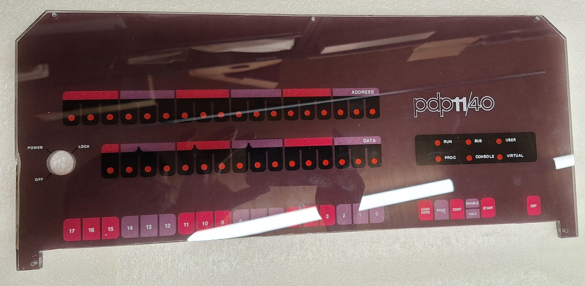
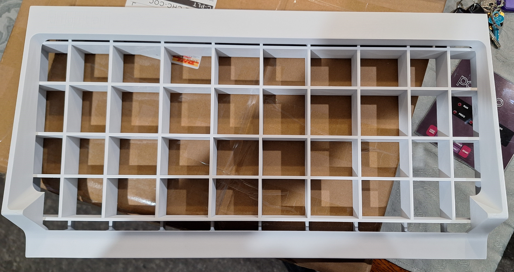

# PDP-11/40 Front Panel Recreation #

This repository contains a to-scale [Adobe Illustrator file](./PDP11.40_panel.ai) that recreates a PDP-11/40 front panel. The goal of the project was to recreate a low cost authentic looking PDP-11 panel. The hope was to print a hi-rez vector directly onto acrylic, this technique is comparatively cheap when compared to silk screen. So far a couple prototypes have been made and the result is there a promising.

## Source ###
The Adobe Illustrator file was created by scanning and an original PDP-11/40 panel then tracing over the original artwork. The resultant file is extremely accurate to my original panel and even create its original imperfections and misaligned visual elements.

The original scans can be found in [images/scans](./images/scans). And approximate dimensions can be found in [dimensions.png](./images/dimensions.png) for more up-to-date dimensions get them form the [Illustrator file](./PDP11.40_panel.ai).

## Replica Bezel ##

In the image is directory you will see a replica bezel that I have had 3D printed by JLCPCB. The source of those files are not currently available. It was originally created by Oscar Vermeulen for the [PiDP-11](https://www.obsolescence.dev/pidp11.html) project and ultimately not mine to share.

## Remaining Tasks ##
 * Finished the key switch cutout.
 * Fabrication instructions
 * Printing jig
 * Find adjustment of text alignment (I dislike it's "authentic" look)

### Out of scope work ###
 * 3D files for printing switches
 * PCB
 * Steel mounting plate